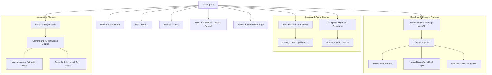

# AMIT KUMAR HOTA - Interactive Portfolio

<div align="center">

[](https://port-amex-portfolio.onrender.com/)
[](https://react.dev/)
[](https://vitejs.dev/)
[](https://tailwindcss.com/)
[](https://threejs.org/)
[](https://opensource.org/licenses/MIT)

<p align="center">
  <strong>A high-performance, cyber-minimalist engineering portfolio and interactive resume.</strong><br>
  Built with React 18, Vite, Three.js shaders, custom WebGL post-processing, 3D physics-based card tilt, tactile audio synthesis, and interactive Spline 3D runtimes.
</p>

[Explore Live Demo ↗](https://port-amex-portfolio.onrender.com/) • [Report Bug](https://github.com/AMEEXX/Amit-Portfolio/issues) • [Request Feature](https://github.com/AMEEXX/Amit-Portfolio/issues)

</div>

---

## 📑 Table of Contents

- [Overview & Philosophy](#-overview--philosophy)
- [System Architecture](#-system-architecture)
- [Key Features & Visual Engineering](#-key-features--visual-engineering)
- [Tech Stack](#-tech-stack)
- [Featured Projects](#-featured-projects)
- [Work Experience](#-work-experience)
- [Repository Structure](#-repository-structure)
- [Local Development & Setup](#-local-development--setup)
- [Deployment](#-deployment)
- [Documentation](#-documentation)
- [Author & Connect](#-author--connect)

---

## 🔭 Overview & Philosophy

This portfolio is crafted as a showcase of both **systems-level engineering depth** and **cutting-edge web interface craftsmanship**. Departing from generic cookie-cutter templates, the application implements a bespoke **cyber-tactile aesthetic**:

- **Hardware & Terminal Inspiration**: Monospaced status readouts, CRT scanline overlays, terminal boot sequence, and mechanical keyboard acoustics.
- **Physicality in Motion**: Spring-damped 3D Euler tilt transforms, glare ray-casting, and interactive card flips with zero layout shift.
- **Real-Time 3D Shaders**: Custom WebGL render passes with dual bloom post-processing, torus geometry, and dynamic camera frustum tracking.
- **Boxy Geometric Language**: Deliberate razor-sharp borders (`border-white/10`), dark slate surfaces (`#1F2121`), and curated typography pairings (`Instrument Serif`, `Onest`, and `Geist Mono`).

---

## 🏛 System Architecture

The frontend is architected as an optimized Single Page Application (SPA) with lazy-loaded 3D runtimes and hardware-accelerated rendering pipelines:



---

## ⚡ Key Features & Visual Engineering

### 1. 🖥️ Interactive Retro Boot Terminal
- Initial interactive cyber boot terminal welcoming users with real-time ASCII diagnostics.
- Synthesized typewriter sound effects and key-click audio feedback powered by Web Audio and Howler.js.
- Interactive commands and customizable view states.

### 2. 🌌 Deep Space Starfield & Torus WebGL Scene
- Engineered using Three.js and custom GLSL shader passes.
- Features dynamic floating star particle fields and a procedural Torus mesh with multi-frequency vertex noise displacement.
- Dual-pass Unreal Bloom creates deep celestial neon lighting with zero performance degradation on mobile via adaptive pixel ratios.

### 3. 🃏 CometCard 3D Physics Tilt & Card Flip
- Project cards calculate real-time mouse delta vectors (`xPct`, `yPct`) transformed via Framer Motion spring dampeners.
- Dynamic radial gradient glare calculation mimics realistic surface ray reflections.
- Click triggers smooth 180° Y-axis flip with backface culling, revealing deep architectural breakdowns and live repository links.
- Grayscale-to-color transition (`saturate-0` to `saturate-100`) with smooth contrast and brightness bloom on hover.

### 4. 🔲 Canvas Reveal Dot-Matrix Effect
- Work experience cards feature an interactive dot-matrix canvas that reveals company branding and role highlights as the cursor moves across the surface.
- Smooth fallback rendering on low-power devices.

### 5. 🎹 Spline 3D Mechanical Keyboard Showcase
- Real-time 3D rendered keyboard model powered by `@splinetool/react-spline`.
- Keys animate with tactile mechanical sound effects when pressed, displaying tech skills mapped to physical keycaps.

### 6. 📜 Lenis Smooth Scrolling
- Ultra-smooth inertial scrolling physics integrated across the document with Lenis.

---

## 🛠 Tech Stack

| Domain | Technologies |
|---|---|
| **Core Framework** | React 18.3.1, Vite 5.4.x, JavaScript (ESNext), TypeScript |
| **Styling & Design System** | Tailwind CSS 3.4.x, PostCSS, Custom Design Tokens |
| **3D & Shaders** | Three.js, `@splinetool/react-spline`, `@splinetool/runtime`, GLSL Shaders |
| **Post-Processing** | `three/addons/postprocessing` (EffectComposer, UnrealBloomPass, ShaderPass) |
| **Animations & Motion** | Framer Motion (`motion/react`), Spring Physics, Lenis Smooth Scroll |
| **Audio Engine** | Howler.js, Web Audio API |
| **Icons & Typography** | Lucide React, Google Fonts (`Instrument Serif`, `Onest`, `Geist Mono`) |
| **Forms & Communication** | Web3Forms API |
| **Deployment & CI/CD** | Render PaaS (`render.yaml`), Git Version Control |

---

## 🚀 Featured Projects

| Project | Domain | Tech Stack | Highlights | Links |
|---|---|---|---|:---:|
| **Attract** | `#AI-VISION` | Kotlin, YOLO, ArcFace Net, TFLite, OpenCV | Mobile facial recognition app for seamless classroom attendance using offline edge AI inference. | [Code](https://github.com/AMEEXX/Attract-AI-Based-Attendance-Tracker) |
| **Citadel** | `#SYSTEMS-SECURITY` | Rust, Tokio, Axum, Win32 API, WFP, Cryptography | Air-gapped, offline secure assessment platform & custom lockdown client with low-level Win32 security APIs and WFP packet isolation. | [Code](https://github.com/AMEEXX/citadel) |
| **PowerStore VSA Migration** | `#DELL-INTERN` | Java, RxJava, Perl, Kubernetes, Docker, Virtualization, CI/CD | Virtualized storage array platform modernization. Optimized microservice communication and reduced VM latency by 14.6%. | *Dell Internal Tool* |
| **YourTube** | `#PRODUCTIVITY` | React, Node.js, MongoDB, Express, YouTube API | Distraction-free educational YouTube streaming client restricted to curated, whitelisted learning resources. | [Demo](https://vercel.com/ameexxs-projects/v0-your-tube-clone) • [Code](https://github.com/AMEEXX/YourTube-rw) |
| **Future Vault** | `#CLOUD-NATIVE` | Java, Spring Boot, Rust, Kafka, Docker | High-throughput asynchronous time-capsule microservice with event-driven message queuing for 1,000+ scheduled notes. | [Demo](https://open-later-rust.vercel.app/) • [Code](https://github.com/AMEEXX/Open_Later_Rust) |
| **Portfolio Web** | `#FRONTEND` | React, TailwindCSS, Framer Motion, Three.js | The interactive portfolio platform featuring custom WebGL shaders, 3D physics tilt cards, and cyber-minimalist design. | [Demo](https://port-amex-portfolio.onrender.com/) • [Code](https://github.com/AMEEXX/Amit-Portfolio) |

---

## 💼 Work Experience

- **Dell Technologies** — *Software Engineer Intern*
  - Worked on the **PowerStore Virtual Storage Array (VSA)** platform team.
  - Modernized virtualization pipelines with Java, RxJava, and Perl.
  - Automated CI/CD deployment matrices and conducted system-level validation, cutting latency by 14.6% and increasing reliability by 17.2%.

- **ideaForge Technologies** — *Software & Firmware Engineering Intern*
  - Engineered core embedded software and hardware telemetry pipelines for enterprise unmanned aerial vehicles (UAVs).
  - Implemented real-time sensor processing and fault-tolerant communication protocols.

---

## 📂 Repository Structure

```
PortAmex/
├── docs/                               # Architecture & design documentation
│   ├── DESIGN_SYSTEM_AND_THEORY.md     # Design token specs & typographic scale
│   └── RESPONSIVE_IMPLEMENTATION_GUIDE.md # Breakpoint & layout engineering
├── public/                             # Optimized static assets & audio sprites
│   ├── assets/
│   │   └── skills-keyboard.spline      # Pre-compiled Spline 3D model
│   ├── dell-logo-trim.png              # Vector-trimmed brand assets
│   ├── ideaforge-logo-trim.png
│   ├── dell-powerstore-all-flash-storage-hero-2998x1400.avif
│   ├── image.png                       # High-fidelity Citadel security visual
│   ├── favicon.ico
│   └── favicon.svg
├── src/
│   ├── components/
│   │   ├── boot-terminal/              # Interactive cyber boot sequence & audio
│   │   ├── effects/                    # Three.js Starfield, LiquidRevealCanvas, EncryptedText
│   │   ├── ui/                         # CometCard, ShinyButton, GradientButton, TracingBeam
│   │   ├── About.jsx                   # Biography & core competencies
│   │   ├── Footer.jsx                  # Footer with bottom-edge AMIT KUMAR HOTA watermark
│   │   ├── Hero.jsx                    # Hero header with typography & call-to-actions
│   │   ├── Navbar.jsx                  # Floating glassmorphic navigation dock
│   │   ├── Portfolio.jsx               # 6-card interactive CometCard showcase
│   │   ├── Stats.jsx                   # Key engineering metrics & impact counters
│   │   └── WorkExperience.jsx          # Dell & ideaForge interactive canvas reveal cards
│   ├── hooks/                          # Custom React hooks (useLenis, etc.)
│   ├── lib/                            # Utility functions (cn, clsx, tailwind-merge)
│   ├── App.jsx                         # Main application layout & scroll orchestration
│   ├── index.css                       # Global styles, scanline filters, typography rules
│   └── main.jsx                        # Application root entrypoint
├── components.json                     # shadcn UI configuration
├── index.html                          # Single-page HTML5 entrypoint
├── package.json                        # Dependencies and build scripts
├── postcss.config.js                   # PostCSS plugins
├── render.yaml                         # Render deployment specification
├── tailwind.config.js                  # Tailwind design system configuration
└── vite.config.js                      # Vite bundler plugins and chunking configuration
```

---

## 💻 Local Development & Setup

### Prerequisites
- **Node.js**: `v18.0.0` or higher
- **npm**: `v9.0.0` or higher

### 1. Clone the repository
```bash
git clone https://github.com/AMEEXX/Amit-Portfolio.git
cd Amit-Portfolio
```

### 2. Install dependencies
```bash
npm install
```

### 3. Start development server
```bash
npm run dev
```
The application will launch at `http://localhost:5173/`.

### 4. Build for production
```bash
npm run build
```
Optimized assets will be emitted to the `dist/` directory.

### 5. Preview production build locally
```bash
npm run preview
```

---

## 🚀 Deployment

The portfolio is continuously deployed to **Render** via infrastructure-as-code:

- Configuration: [`render.yaml`](./render.yaml)
- Build Command: `npm run build`
- Publish Directory: `dist`
- Live URL: [https://port-amex-portfolio.onrender.com/](https://port-amex-portfolio.onrender.com/)

---

## 📚 Documentation

For in-depth explanations of design philosophies, color systems, and responsive layouts:
- [Design System & Styling Theory](./docs/DESIGN_SYSTEM_AND_THEORY.md)
- [Responsive Layout & Cross-Device Engineering Guide](./docs/RESPONSIVE_IMPLEMENTATION_GUIDE.md)

---

## 👨‍💻 Author & Connect

**Amit Kumar Hota**  
*Systems & Cloud Engineer • Full-Stack Developer*

- 🌐 **Portfolio**: [port-amex-portfolio.onrender.com](https://port-amex-portfolio.onrender.com/)
- 🐙 **GitHub**: [@AMEEXX](https://github.com/AMEEXX)
- 💼 **LinkedIn**: [linkedin.com/in/amit-kumar-hota](https://www.linkedin.com/in/amit-kumar-hota-b16954217/)
- 📧 **Email**: [amitkumarhotaofficial@gmail.com](mailto:amitkumarhotaofficial@gmail.com)

---

<div align="center">
  <sub>Designed & engineered with precision by Amit Kumar Hota. © 2026 All Rights Reserved.</sub>
</div>
